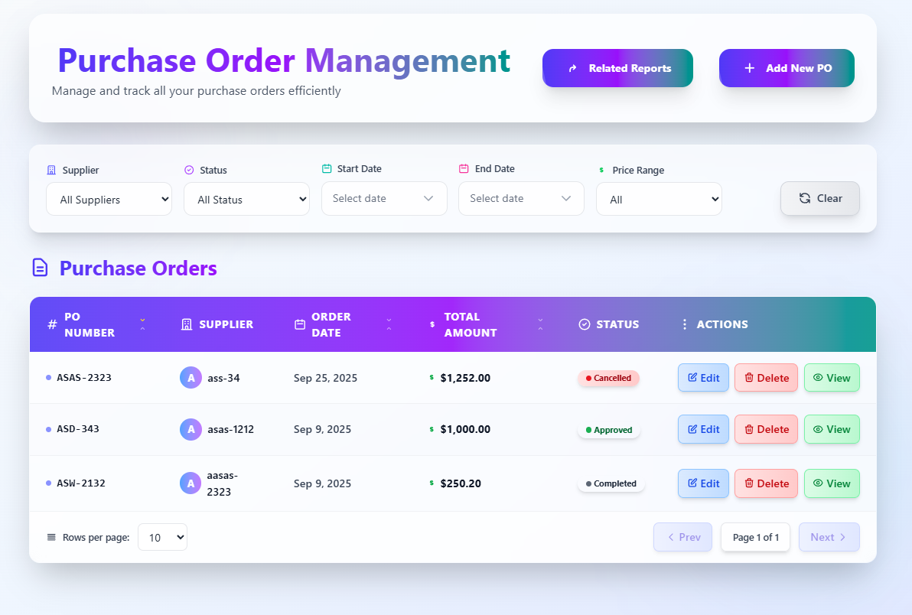

# 📦 Purchase Order Management Application

Welcome to the coding exercise!  
This application is a **Purchase Order Management System** built with **.NET 9 (Web API)**, **Angular**, and **SQL Database (Code First)**.  

It allows procurement staff to **manage purchase orders (POs)** with features like **listing, filtering, sorting, pagination, add/edit/delete**.  



---

## Overview

 A full‑stack Purchase Order Management application built to demonstrate real‑world engineering practices
 using .NET Core (backend), Angular (frontend), and SQL (relational database). The project emphasizes a
 clean, modular architecture, SOLID principles, testability, and maintainability.
 
 This README explains the project purpose, how to run it locally, the architecture and design decisions, and
 How to evaluate the work.
---

## Architecture & Design Decisions

- **Clean Architecture:** Separation of concerns into layers (API, Application / Use Cases, Domain, Infrastructure) to keep core domain independent of frameworks
- **SOLID Principles:**
  - Single Responsibility: Controllers are small, services-focused
  - Dependency Inversion: Use interfaces and DI
  - Open/Closed: Services are extendable without modifying existing code
  - Liskov Substitution & Interface Segregation applied where relevant
- **Repository & Unit of Work:** Abstractions for data access for easier testing and flexibility
- **DTOs:** Used for API surface and mapping to domain entities to decouple internal models
- **Validation:** Centralized request validation using Data Annotations
- **Error Handling:** Global exception middleware to return consistent error responses
---

## Example API Endpoints

- `GET /api/purchase-orders` — list purchase orders
- `GET /api/purchase-orders/{id}` — get single order
- `POST /api/purchase-orders` — create order (payload: supplier, date, lines)
- `PUT /api/purchase-orders/{id}` — update order
- `DELETE /api/purchase-orders/{id}` — delete order

Request/response shapes are described in the `Application/DTOs` folder.

---

## 🚀 Features

### 1. List of Purchase Orders
- Display purchase orders in a **tabular view**.
- Support **filtering** (by supplier, status, or date range).
- Support **sorting** (by PO number, order date, total amount).
- Support **pagination** for large datasets.

### 2. Manage Purchase Orders
- Create new purchase orders.
- Update existing purchase orders.
- Delete purchase orders.

### 3. Purchase Order Fields
- **PO Number** (unique identifier)
- **Description**
- **Supplier Name**
- **Order Date**
- **Delivery Date**
- **Total Amount**
- **Status** (Draft / Approved / Shipped / Completed / Cancelled)

---

## 📌 Assumptions

- **PO Number** must always be unique.  
- **Status** can only be one of: Draft, Approved, Shipped, Completed, or Cancelled.  
- **Total Amount** is always stored and displayed with **two decimal places**.  

### Filtering Assumptions
- Supplier filtering uses an **exact match** (case-insensitive).  
- Status filtering uses the predefined `POStatus` enum values.  
- Date range filtering uses **inclusive range** (`>= startDate` and `<= endDate`).  

### Sorting Assumptions
- PO Number, Order Date, or Total Amount can apply sorting.  
- Sorting defaults to **ascending order** unless explicitly requested as descending.  
- Only one column can be sorted at a time (for simplicity).  

### Pagination Assumptions
- Default page size is 10.  
- The client can change the page size.  

### Performance Assumption
- Filtering, sorting, and pagination are implemented to handle large datasets.  

---

## ⚙️ Tech Stack

- **Backend**: .NET 9 Web API  
- **Frontend**: Angular 20+  
- **Database**: MySQL Server (EF Core Code First)  
- **ORM**: Entity Framework Core  

---

## 🛠️ Setup Instructions


### 1. Install .NET 9
- Download and install .NET 9 SDK from the official site:  
  [https://dotnet.microsoft.com/en-us/download/dotnet/9.0](https://dotnet.microsoft.com/en-us/download/dotnet/9.0)
- Verify installation:

```bash
dotnet --version
```
### 2. Install Node.js and Angular (20)

- **Install Node.js** (which includes npm)  
  1. Go to [https://nodejs.org](https://nodejs.org)  
  2. Download the **LTS** version (recommended) or Node 20+ for Angular 20  
  3. Run the installer and follow the prompts  

- **Verify Node.js installation**:

```bash
node -v
npm -v
npm install -g @angular/cli
```

### 2. Clone Repository
```bash
git clone https://github.com/your-username/purchase-order-management.git
cd Purchase-Order-Management-FullStack
```

### 3. Start XAMPP / Install
- Install **XAMPP** (if not already installed).  
- Start **Apache** and **MySQL** services.  
- Make sure your MySQL connection string in `appsettings.json` matches your local credentials.
  
Example:
```json
"ConnectionStrings": {
  "DefaultConnection": "server=localhost;database=PurchaseOrderDB;user=root;password=;"
}
```

### 4. Backend Setup

1. Navigate to the backend folder and build the project:

```bash
cd backend
dotnet build
```

2. Run initial Entity Framework migrations to create the database schema

```bash
cd PurchaseOrderManagement.WebApi
dotnet ef migrations add InitialCreate --project ../PurchaseOrderManagement.Infrastructure --startup-project .
dotnet ef database update --project ../PurchaseOrderManagement.Infrastructure --startup-project .
```

3. Run Backend Web Api

```bash
dotnet run
```

### 5. Frontend Setup 

1. Navigate to the frontend folder and build the project (got to the root):
```bash
cd frontend
cd purchase-order
````

2. Install dependencies and start the application:
```bash
npm i
npm start
````
---
## Contact

- Author: **Chethiya Bandara Herath**
- Email: **chethiyabandaraherath@gmail.com**
- Mobile: **+94757120896**

